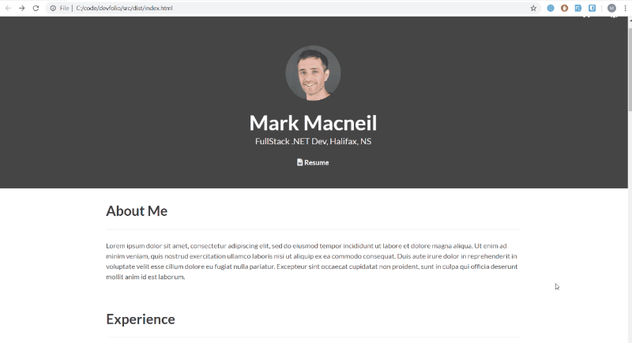

# Data Scientist
Technical Skills: Python, SQL, AWS, PowerBI, C/C++

Portfolio: [lucastramonte.github.io](https://lucastramonte.github.io/)

## Project

This repository contains my personal portfolio website.

- Host: GitHub Pages
- Runtime: static frontend only (no backend, no database)

## Tech stack

- HTML
- SCSS/CSS
- JavaScript
- Webpack

## Repository structure

### Main files
- [index.html](index.html): page structure and content
- [css/main.bundle.css](css/main.bundle.css): compiled styles
- [js/bundle.js](js/bundle.js): compiled interaction logic
- [js/theme-toggle.js](js/theme-toggle.js): light/dark theme toggle
- [js/runtime-audit.js](js/runtime-audit.js): optional runtime debug logs

### Source and build files
- [src/index.js](src/index.js): JavaScript source entry
- [styles.scss](styles.scss) and [src/styles.scss](src/styles.scss): style sources
- [webpack.config.js](webpack.config.js): build configuration
- [package.json](package.json): scripts and dependencies

### Assets and docs
- [img](img): images
- [docs](docs): CV and other files
- [logs/README.md](logs/README.md): logging notes

## How I work in this repository

1. Content and section updates are made in [index.html](index.html).
2. Theme and interaction changes are made in JavaScript files.
3. Styling changes are made in SCSS and then compiled.
4. Static assets are versioned in this repository and deployed through GitHub Pages.

## Local run (Windows / PowerShell)

### Quick local preview
Open [index.html](index.html) directly in a browser.

### Build workflow (requires Node.js)
1. Install Node.js LTS.

   Option A (recommended):
   - `winget install OpenJS.NodeJS.LTS --accept-package-agreements --accept-source-agreements`

   Option B:
   - Install from nodejs.org (LTS installer).

2. Close and reopen PowerShell after installation.

3. Verify installation:
   - `node -v`
   - `npm -v`

   If commands are still not found in the current session, run:
   - `$env:Path = "C:\Program Files\nodejs;" + $env:Path`
   - `node -v`
   - `npm -v`

4. Install dependencies:
   - `npm install`

5. Build:
   - `npm run build`

6. Build with audit log:
   - `npm run build:audit`

7. Verify generated logs:
   - `Get-ChildItem .\logs -File | Sort-Object LastWriteTime -Descending`

### Command checklist (end-to-end)

From repository root:

1. `node -v`
2. `npm -v`
3. `npm install`
4. `npm run build`
5. `npm run build:audit`
6. `Get-ChildItem .\logs -File | Sort-Object LastWriteTime -Descending`
7. `$latest = Get-ChildItem .\logs\build_production_*.log | Sort-Object LastWriteTime -Descending | Select-Object -First 1; if ($latest) { Get-Content $latest.FullName -TotalCount 20 }`

Expected file pattern:
 - `build_production_YYYY-MM-DD_HH-mm-ss.log`

Optional development audit build:
 - `npm run dev:audit`

Notes:
 - Sass/Bulma deprecation warnings can appear during build; these are warnings, not build failures.
 - `npm install` can report vulnerabilities; this is not a build blocker for local run.
 - Runtime debug logs are shown in browser DevTools console, not in files under `logs/`.

### Troubleshooting

#### Error: `node` or `npm` is not recognized
- Cause: Node.js not installed, or terminal session has stale PATH.
- Fix:
   1. Install Node LTS.
   2. Restart PowerShell.
   3. If needed, run `$env:Path = "C:\Program Files\nodejs;" + $env:Path`.

#### Error during `npm install` related to `node-gyp` / Visual Studio / C++ toolset
- Cause: package with native compilation requirement.
- Current project status: dependency set uses `sass` (Dart Sass) to avoid native `node-sass` compilation.
- Fix sequence:
   1. Ensure latest repository changes are pulled.
   2. Remove local install artifacts: `Remove-Item -Recurse -Force .\node_modules, .\package-lock.json` (optional but clean).
   3. Run `npm install` again.

#### `npm run build:audit` exits with warning output
- Cause: some tools print warnings to stderr.
- Current project status: [scripts/build-audit.ps1](scripts/build-audit.ps1) handles this flow and still writes logs when build succeeds.

#### Build succeeds but logs are not visible
- Check folder listing: `Get-ChildItem .\logs -File`.
- Verify filename pattern starts with `build_production_`.
- Open latest log with `Get-Content` command from the checklist above.

## Runtime debug logs

Runtime logs are disabled by default.

Enable:
- `localStorage.setItem('debug', '1')`

Disable:
- `localStorage.removeItem('debug')`

Logs are shown in browser DevTools console.

## Documentation

This repository has two README files by design:
- [README.md](README.md): project overview and workflow
- [logs/README.md](logs/README.md): logging details

## Reference and attribution

This portfolio is based on the DevFolio concept created by Mark Macneil.

- Original project reference: https://github.com/mmacneil/devfolio
- Local visual reference used in this repository: [docs/devfolio-desktop.gif](docs/devfolio-desktop.gif)

